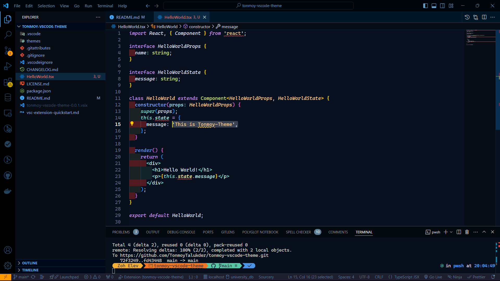

# Tonmoy-Theme

## 🎨 A Customized VS Code Theme for Everyday Coding

Welcome to **Tonmoy-Theme**, the VS Code theme I use for coding every day. It's designed for a sleek, dark interface that enhances focus and productivity.

### 💡 Why Choose Tonmoy-Theme?

- **Perfect for Long Coding Sessions**: Designed with comfortable colors that reduce eye strain during long coding sessions.
- **Sleek and Modern Look**: A beautiful dark theme with a harmonious color palette.
- **Tailored for Developers**: Based on my personal coding preferences, optimized for readability and clarity.

### 🔍 How to Install

1. Open your **VS Code** editor.
2. Go to the **Extensions** view by clicking on the Extensions icon in the Activity Bar on the side of the window.
3. Search for **Tonmoy-Theme** in the marketplace.
4. Click **Install** and start coding with a fresh new theme!

### 🎉 Features

- **Dark Mode**: Perfect for night-time coding or reducing eye strain.
- **Elegant Colors**: Well-balanced hues that improve visibility and coding clarity.
- **Optimized for All Coding Languages**: Works great with JavaScript, Python, HTML, and more!

### 💬 How to Use

Once installed, you can activate the theme by following these steps:

1. Press `Ctrl+Shift+P` (or `Cmd+Shift+P` on Mac) to open the Command Palette.
2. Type `Color Theme` and select **Tonmoy-Theme** from the list.

### 🌟 Screenshot

### 📦 Features in This Theme

- Custom colors for variables, functions, and classes.
- Clear contrast for easier code readability.
- Optimized for dark environments.

### 🤝 Contribute

Feel free to open issues and pull requests if you’d like to contribute to improving **Tonmoy-Theme**!

#### To contribute:
1. Fork the repository.
2. Make your changes.
3. Create a pull request.

I welcome suggestions, bug fixes, or improvements.

### 🔗 Links

- **GitHub Repository**: [Tonmoy-Theme on GitHub](https://github.com/tonmoy/tonmoy-vscode-theme)  
- **VS Code Marketplace**: [Tonmoy-Theme Extension](https://marketplace.visualstudio.com/items?itemName=tonmoy.Tonmoy-Theme)

### 🙏 Acknowledgements

Special thanks to all the open-source communities that made this theme possible.
